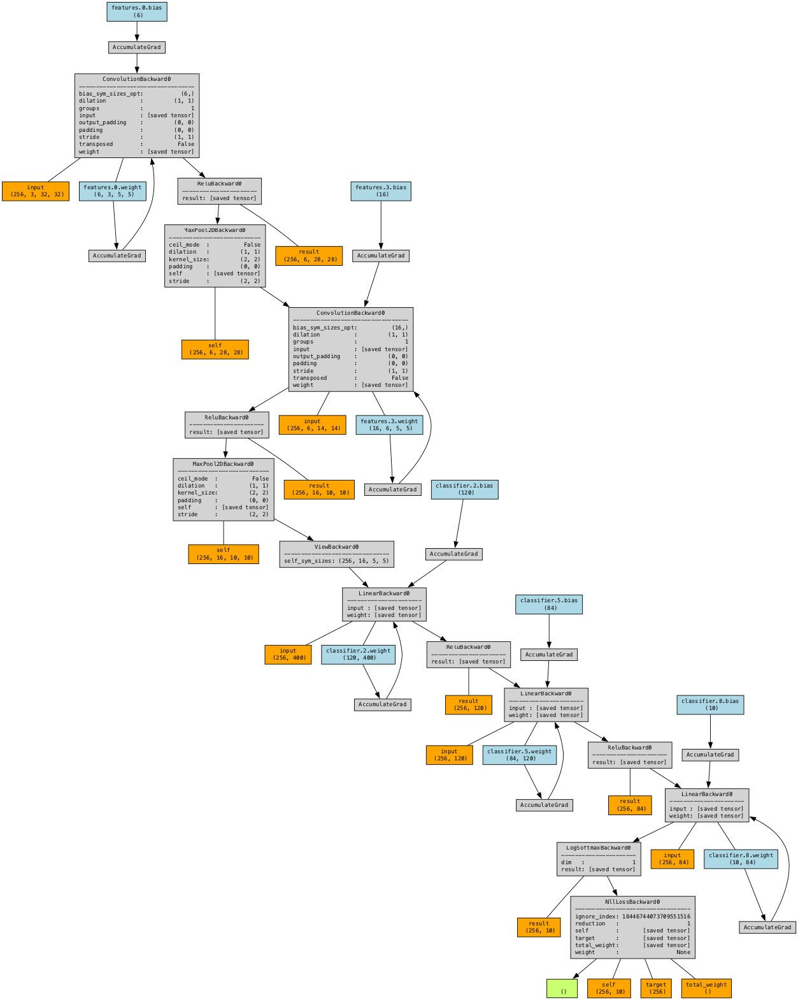
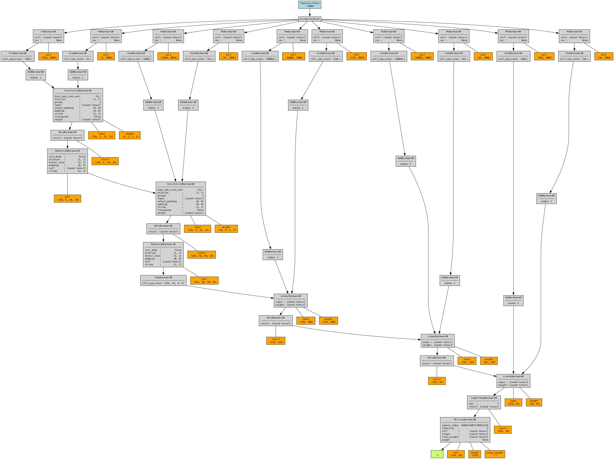
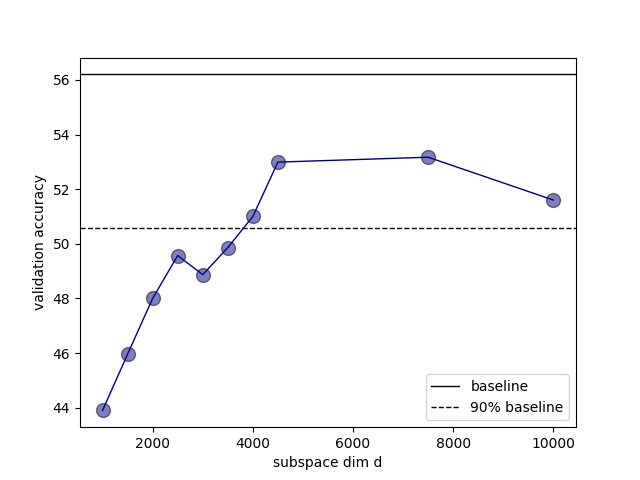

# conv layer stack (lenet architecture) for cifar-10 classification

### Problem Definition

We first train a 62006 param baseline model on the cifar-10 dataset. We get a validation accuracy of ~55%.
Next, we wrap the linear layers with a shared trainable vector of dimension `d` and train the model for a range of values of `d`.

Here is a comparison of the model architectures:

| baseline                                          | d = 3000                                               |
|---------------------------------------------------|--------------------------------------------------------|
|  |  |

It can be seen that there is just one trainable parameter (blue box) in the right which is 3000 dimensional. And that is all it takes to train cifar-10 to 90% of the baseline.

### Results

It can be seen that the 90% accuracy is achieved starting from `d=3000` which confirms the hypothesis posited by the paper.
