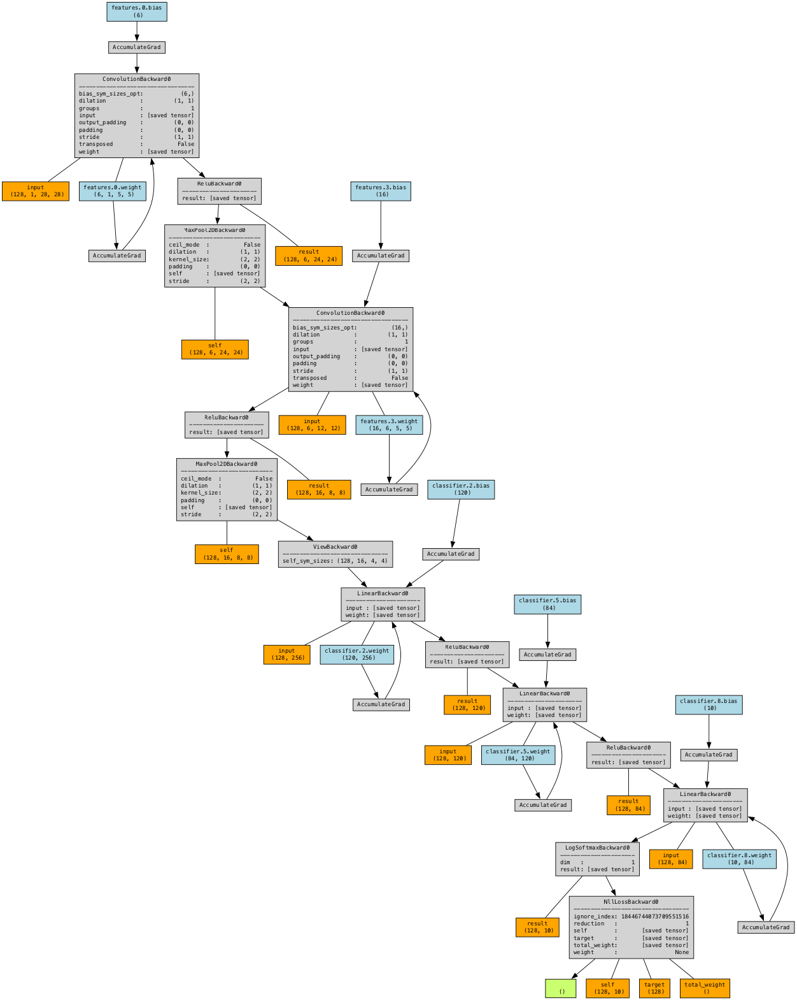
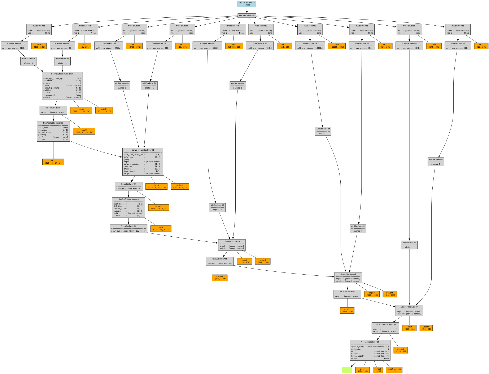
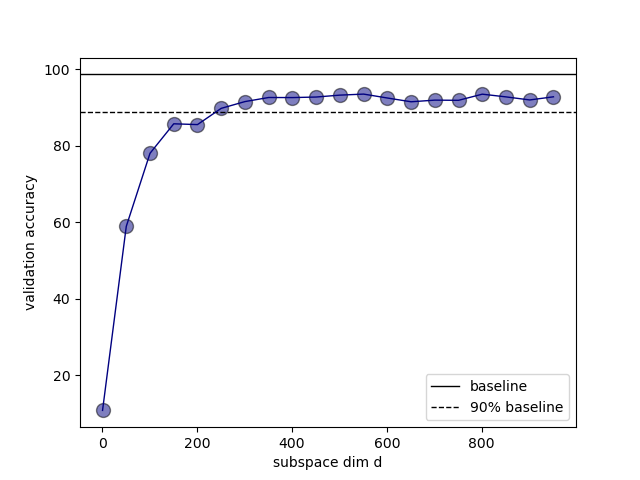

# conv layer stack (lenet) for mnist classification

### Problem Definition

We first train a 44426 param baseline model on the mnist digits dataset. We get a validation accuracy of ~98%.
Next, we wrap the linear layers with a shared trainable vector of dimension `d` and train the model for a range of values of `d`.

Here is a comparison of the model architectures:

| baseline                                          | d = 300                                                |
|---------------------------------------------------|--------------------------------------------------------|
|  |  |

It can be seen that there is just one trainable parameter (blue box) in the right which is 300 dimensional. And that is all it takes to train mnist to 90% of the baseline.

### Results

It can be seen that the 90% accuracy is achieved starting from `d=600-750` which confirms the hypothesis posited by the paper.
