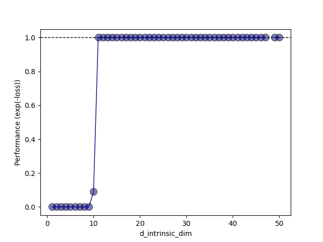

# toy example: 1000 dimensional vector search

### Problem Definition

The paper defines a toy example initially to define the intrinsic dimension of a generic objective landscape.

> We introduce the intrinsic dimension of an objective landscape with an illustrative toy problem. Let $\theta^{(D)} ∈ \mathbb{R}^D$ be a parameter vector in a parameter space of dimension $D$, let $\theta^{(D)}_0$ be a randomly chosen initial parameter vector, and let $\theta^{(D)}_*$ be the final parameter vector arrived at via optimization. Consider a toy optimization problem where $D = 1000$ and where $\theta^{(D)}$ optimized to minimize a squared error cost function that requires the first 100 elements to sum to 1, the second 100 elements to sum to 2, and so on until the vector has been divided into 10 groups with their requisite 10 sums. We may start from a $\theta^{(D)}_0$ that is drawn from a Gaussian distribution and optimize in $\mathbb{R}^D$ to find a $\theta^{(D)}_*$ that solves the problem with cost arbitrarily close to zero.

The implementation details from the paper are given as follows:

> Standard optimization, which we will refer to hereafter as the direct method of training, entails evaluating the gradient of a loss with respect to $\theta^{(D)}$ and taking steps directly in the space of $\theta^{(D)}$. To train in a random subspace, we instead define $\theta^{(D)}$ in the following way:
\[ \theta^{(D)} = \theta^{(D)}_0 + P \theta^{(d)} \] where $P$ is a randomly generated $D \times d$ projection matrix and $\theta^{(d)}$ is a parameter vector in a generally smaller space $\mathbb{R}^d$. $\theta^{(D)}_0$ and $P$ are randomly generated and frozen (not trained), so the system has only $d$ degrees of freedom. We initialize $\theta^{(d)}$ to a vector of all zeros, so initially $\theta^{(D)}$ = $\theta^{(D)}_0$.

And finally, the evaluation metric is defined as:

> For this toy problem we define $\text{performance} = e^{−loss}$, bounding performance between 0 and 1, with 1 being a perfect solution.

### Results

results start appearing at $d = 10$ as posited by the paper which confirms the hypothesis.